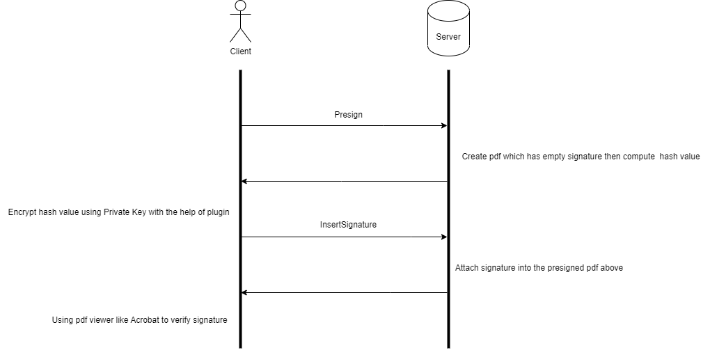

# X509 Pdf Signer

## Table of Contents

- [About](#about)
- [Getting Started](#getting_started)
- [Usage](#usage)

## About 

This ASP.NET MVC web app was built to demo logic of digital signing a Pdf file. Here is the workflow:
  

## Getting Started 

These instructions will get you a copy of the project up and running on your local machine for development and testing purposes.
### Prerequisites
<ul>
    <li>Visual studio 2017 or higher</li>
    <li>dotNET 4.5.1 or higher</li>
</ul>

### Installing

<ul>
    <li>
    The /Refs folder has TokenService.zip file contain plugin need to be install. It is a X509 service run at localhost:8888. We use it to emulate to get certificate and get encrypted data
    </li>
    <li>
        After install the plugin, navigate to /Web project and open .sln file. Wait a while for VS load all required packages. Rememeber to clean project before run it.
    </li>
</ul>

## Usage 

Take some time to play around with my code. When you understand it you can copy some functions you need.
